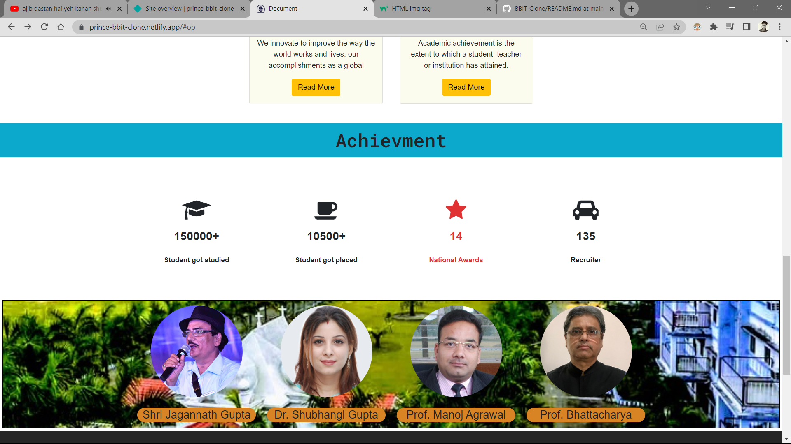

# BBIT-Clone
This is a GitHub repository  containing our College Clone web page. 
Our user-friendly web application showcases courses, faculty, and campus life for prospective students. 
Features include student reviews, interactive maps, and a news feed. Built using   HTML, CSS, and Bootstrap (frontend framework)

Page Link:  <a target="_blank" href="https://prince-bbit-clone.netlify.app/" target="_blank"> https://prince-bbit-clone.netlify.app/ </a>

 

