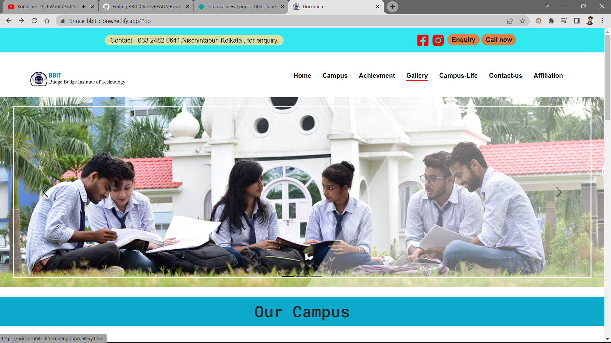

# BBIT-Clone
This is a Github repository  contains our College Clone web page. 
Our user-friendly web application showcases courses, faculty, and campus life for prospective students. 
Features include student reviews, interactive maps, and a news feed. Built using   HTML, CSS, and bootstrap(frontend freamework)

Page Link: https://prince-bbit-clone.netlify.app/

 
